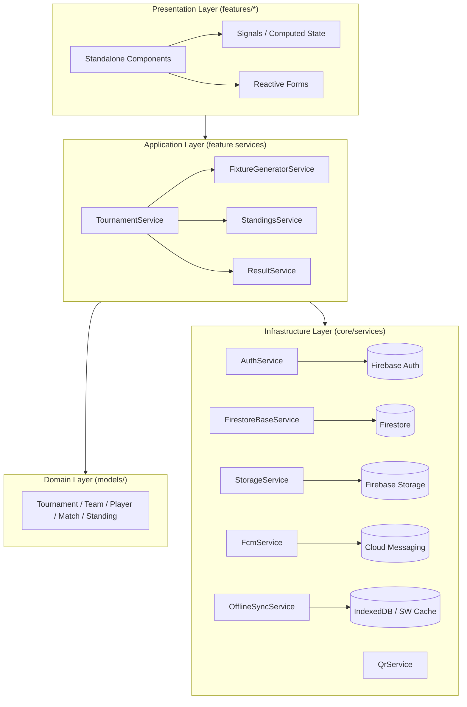
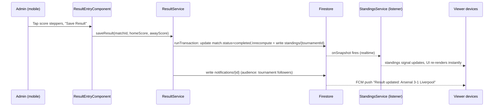

# PitchPro — System Architecture

## 1. Overview

PitchPro is a mobile-first Progressive Web App for running football (soccer) tournaments: creating
competitions, managing teams, generating fixtures, entering results, and giving players/spectators
real-time standings, statistics, QR-based sharing and check-in — all usable offline at the pitch.

**Stack:** Angular 20 (standalone components + Signals) · Angular Material · Tailwind CSS · RxJS ·
Firebase (Auth, Firestore, Storage, Cloud Messaging, Hosting) · Chart.js/ng2-charts · Angular
Service Worker (PWA).

## 2. Architectural style

The app follows **Clean Architecture** adapted to an Angular SPA, organized around three concentric
layers, plus a horizontal **feature-module** split for scalability:



Rules of dependency: **outer layers depend inward, never the reverse.** Components never call the
Firebase SDK directly — they depend on feature services, which depend on `core/services` wrappers
around Firebase. This keeps Firestore-specific code (converters, query shapes) out of components and
makes the domain layer (`models/`) framework-agnostic and unit-testable.

## 3. Folder structure

```
src/app/
├── core/                     # Singletons, cross-cutting concerns (provided in root)
│   ├── services/
│   │   ├── auth.service.ts          # Firebase Auth wrapper, current-user signal, role resolution
│   │   ├── firestore-base.service.ts# Generic typed CRUD + query helpers over AngularFire
│   │   ├── storage.service.ts       # Firebase Storage upload/download helpers
│   │   ├── fcm.service.ts           # FCM token registration + foreground message handling
│   │   ├── qr.service.ts            # QR code generation (data URL) + payload encode/decode
│   │   └── offline-sync.service.ts  # Online/offline signal, pending-writes queue, sync-on-reconnect
│   ├── guards/
│   │   ├── auth.guard.ts            # Blocks unauthenticated access to protected routes
│   │   └── admin.guard.ts           # Blocks non-admin access to admin-only routes
│   └── interceptors/
│       └── loading.interceptor.ts   # (HTTP calls, e.g. external APIs) global loading indicator
│
├── models/                   # Pure TypeScript interfaces — the Domain layer
│   ├── user.model.ts
│   ├── tournament.model.ts
│   ├── team.model.ts
│   ├── player.model.ts
│   ├── match.model.ts
│   ├── standing.model.ts
│   ├── notification.model.ts
│   └── checkin.model.ts
│
├── shared/                   # Reusable, presentation-only building blocks
│   ├── components/
│   │   ├── bottom-nav/              # Sofascore-style mobile bottom navigation
│   │   ├── header/                  # App bar (mobile) / top nav (desktop)
│   │   ├── match-card/              # Flashscore-style match card
│   │   ├── standing-row/            # Compact mobile standings row (#pos, team, pts, form)
│   │   ├── loading-spinner/
│   │   ├── empty-state/
│   │   └── confirm-dialog/
│   ├── pipes/
│   └── directives/
│
├── features/                 # Lazy-loaded route-level feature modules
│   ├── auth/                 # login, register
│   ├── home/                 # public landing page
│   ├── dashboard/            # admin dashboard + charts
│   ├── tournament/           # list, detail (tabbed), create/edit form
│   ├── teams/                # CRUD + full-screen mobile dialog
│   ├── fixtures/             # fixture generation (round robin / knockout) + list
│   ├── results/              # one-handed result entry
│   ├── standings/            # real-time ranking engine + mobile views
│   ├── statistics/           # charts (doughnut/bar) per tournament + global
│   ├── notifications/        # in-app notification center (FCM-backed)
│   ├── checkin/              # QR generation + QR scan check-in
│   └── profile/              # account/profile + role display
│
├── app.component.ts          # Shell: bottom nav (mobile) / sidenav (desktop), router-outlet
├── app.config.ts             # Providers: Firebase, Material, Animations, Router, Service Worker
└── app.routes.ts             # Root route table (lazy loadComponent/loadChildren + guards)
```

Every feature is **self-contained**: its own routes, components and a service that owns Firestore
access for that domain. Cross-feature communication happens through shared services in `core/` or by
composing models — never by one feature importing another feature's internals.

## 4. Key design decisions

| Decision | Rationale |
|---|---|
| **Standalone components everywhere, no NgModules** | Simpler DI graph, smaller bundles, aligns with Angular 20 direction, enables fine-grained lazy loading (`loadComponent`) per route. |
| **Signals for local/UI state, RxJS for streams** | Firestore's realtime listeners are naturally observables (`@angular/fire/firestore` `collectionData`/`docData`); we bridge them to Signals with `toSignal()` at the service boundary so components read plain signals and get automatic OnPush-friendly change detection. |
| **OnPush change detection on all components** | Combined with Signals/`toSignal`, this minimizes re-renders — essential for low-end Android devices on the pitch. |
| **Denormalized `standings` collection** | Recomputing standings from all matches on every read would be expensive and can't be a simple realtime listener. Instead, `ResultService.saveResult()` recalculates and **writes** the standings document as part of the same batched write that saves the match result, so viewers get instant realtime updates via a plain `standings/{tournamentId}` listener. |
| **Firestore offline persistence + explicit `OfflineSyncService`** | Firestore's IndexedDB persistence already caches reads and queues writes offline; `OfflineSyncService` adds an app-level "you are offline / N changes pending" UI signal so admins entering results pitch-side get clear feedback rather than silent queuing. |
| **QR payloads are plain deep links, not custom binary** | `https://<host>/t/{tournamentId}?ref=qr` and `https://<host>/checkin/{teamId}?token=...` — any camera app can open them, no proprietary scanner required (the in-app scanner is a UX nicety, not a requirement). |
| **Full-screen dialogs for create/edit forms on mobile** | `MatDialogConfig` with `{ width: '100vw', height: '100dvh', maxWidth: '100vw' }` and a breakpoint check (`BreakpointObserver`) — centered dialogs are unusable one-handed on a phone. |
| **Role model kept simple (`admin` / `viewer`)** | Matches the spec's three actors (Admin / Viewer / Guest — Guest is simply "no `AuthService.user()`"). A `managerUid` field on `teams` grants a viewer limited "manage my own team" rights (roster, check-in) without a full RBAC system. |

## 5. Data flow example — entering a match result



If the admin is offline, the transaction is queued locally by Firestore's persistence layer;
`OfflineSyncService` shows "Result saved — will sync when you're back online," and the write
flushes automatically on reconnect (Firestore replays queued writes in order).

## 6. Mobile-first rendering strategy

* **Bottom navigation** (`shared/components/bottom-nav`) is the primary nav on all viewports
  `< 768px`; a `BreakpointObserver` swaps to a left sidenav + top bar at `≥ 1024px` (see
  `app.component.ts`).
* **No data tables on mobile.** Standings render as stacked cards (`standing-row`); an explicit
  "Table view" toggle offers a horizontally-scrollable table for power users/desktop.
* **Sticky, swipeable tabs** on the tournament detail page use Angular CDK's
  `Observers`/`ObserversModule`-free approach: a `mat-tab-group` with `[dynamicHeight]` plus a
  lightweight touch handler for left/right swipe (`HammerModule` is intentionally avoided — it's
  unmaintained; a small custom `touchstart`/`touchend` delta directive is used instead, see
  `shared/directives`).
* **One-handed result entry**: large `+`/`–` steppers and big tap targets (≥44px) instead of native
  number inputs, positioned within thumb reach at the bottom of the screen.

## 7. Performance strategy (targets: First Load < 2s, Lighthouse > 90)

1. **Route-level code splitting** — every feature uses `loadComponent`/`loadChildren`; only
   `home` + `auth` ship in the initial bundle.
2. **OnPush + Signals** everywhere — avoids Zone.js-driven full-tree checks.
3. **Firestore pagination** — `TournamentService.listPaged()` / `MatchService.listPaged()` use
   `startAfter(lastDoc)` cursors with a default page size of 20.
4. **Image optimization** — Storage uploads are resized client-side (via `<canvas>`, see
   `storage.service.ts`) to a max of 1600px before upload; `NgOptimizedImage` is used for all
   `` bindings to team/tournament logos with explicit width/height to avoid layout shift.
5. **Tree-shaking** — Angular Material components are imported individually per-component, not via
   a barrel `MaterialModule`.
6. **Service worker asset caching** (`ngsw-config.json`) — app shell prefetched, images cached with
   a performance-first strategy, Firestore REST calls cached with a freshness-first strategy so the
   UI still responds instantly offline while preferring fresh data when online.

## 8. Security model

See `firestore.rules` / `storage.rules` and `SECURITY.md` for the full rule set. Summary:

* **Guests** (no auth): read-only on `tournaments`, `teams`, `matches`, `standings` — everything a
  spectator needs, nothing else.
* **Viewers** (signed in): same reads, plus can create their own `users/{uid}` profile and mark
  their own notifications read.
* **Team managers** (a `viewer` whose uid matches `teams/{id}.managerUid`): can update their own
  team's roster/logo and check their own team in.
* **Admins**: full read/write on tournaments, teams, matches, standings, notifications, check-ins.
  Admin status lives on `users/{uid}.role` and cannot be self-elevated from the client (rules forbid
  a user from writing their own `role` field on update — promotion to admin must happen via the
  Firebase Console or a trusted Cloud Function in production).

## 9. Where a real backend function would help (out of scope for this client-only build)

The client can do almost everything by writing directly to Firestore under Security Rules, which
keeps this a "Firebase-only, no custom server" architecture as requested. Two spots are noted as
**recommended Cloud Functions** for a hardened production deployment, with the client-side fallback
already implemented so the app works without them:

* **Role promotion** (`viewer → admin`) — currently a manual Console edit; a callable function with
  an allow-list would be safer for multi-admin orgs.
* **Fan-out push notifications** — `NotificationService` writes a `notifications` doc per event;
  a Firestore-triggered function (`onCreate`) is the standard way to actually call the FCM Admin SDK
  and deliver the push (a pure client cannot call the FCM send API — it can only *receive* pushes
  and register tokens). This is documented in `DEPLOYMENT.md` §6 as an optional add-on.
