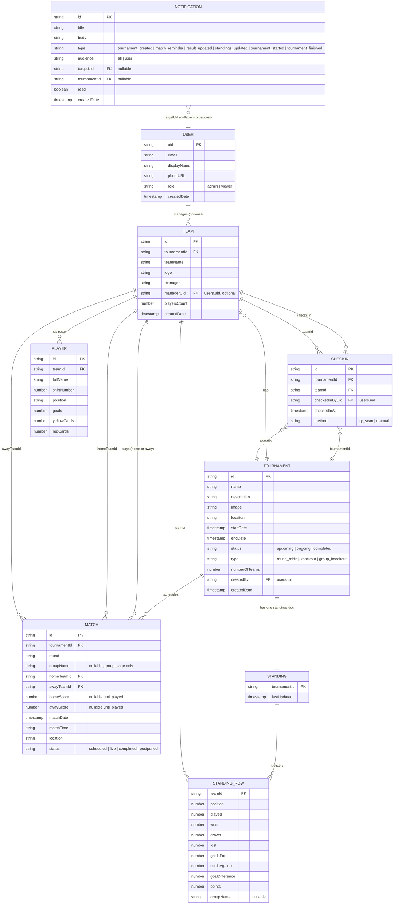

# Entity-Relationship Diagram

Firestore is a document database (no joins/foreign keys enforced by the engine itself), but the app
maintains a clear relational shape via ID references. This is the logical ER model:

## Notes on denormalization

* `STANDING_ROW.teamId` duplicates `TEAM.teamName` and `TEAM.logo` at write time (not shown above as
  separate fields for brevity, but present in `standing.model.ts` as `teamName`/`teamLogo`) so the
  standings view never needs a second read per row — critical for a fast mobile list render.
* `TEAM.playersCount` is a counter maintained by Cloud Firestore triggers-equivalent client logic
  (incremented/decremented in the same batch as player add/remove) rather than counted live, to keep
  the team list query cheap.
